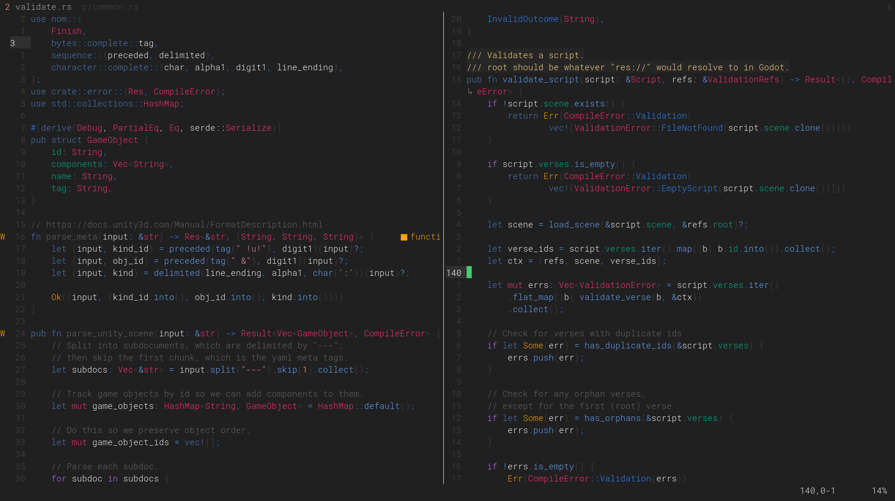

# Setup

Using `lazy.nvim`:

```lua
  {
	'frnsys/futora',
  	lazy = false,
	priority=1000,
	dependencies = {
      "rktjmp/lush.nvim",
	},
  },
```

# Editing

- Edit `lua/lush_theme/futora.lua`
- Run `:Lushify`


